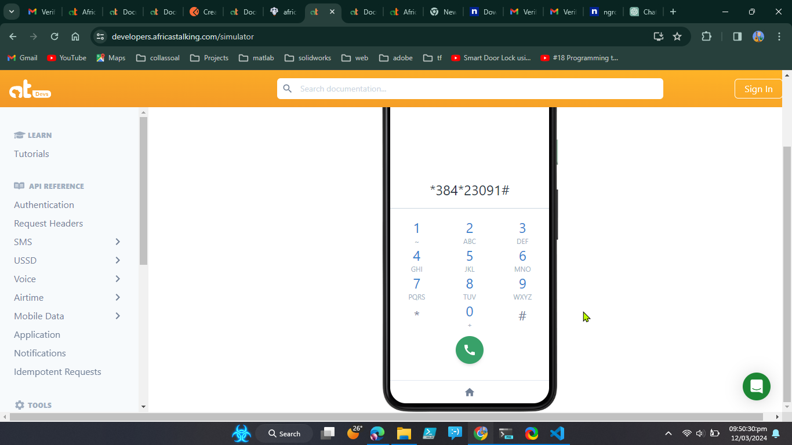

# Sokookoa - USSD Hackathon Project

## 📌 Overview
Sokookoa is a USSD-based platform designed to help farmers easily sell their farm produce. This project was developed using Python for the **Africans Talking USSD Hackathon**.

## 🖼️ USSD Demo


## 🌱 Features
- 📲 **USSD Interface** - Farmers can access the service via USSD.
- 🛒 **Sell Farm Produce** - Allows farmers to list and sell their produce easily.
- 📦 **Order Management** - Buyers can browse available farm produce and place orders.
- 📊 **Market Insights** - Farmers receive price trends and demand insights.
- 🔐 **Secure Transactions** - Ensures safe interactions between farmers and buyers.

## 🛠️ Technologies Used
- **Python** 🐍 - Backend logic and processing.
- **Africastalking API** 📡 - USSD service integration.
- **SQLite** 🗄️ - Database for storing farmer and produce details.
- **Flask** 🚀 - Web framework for handling requests.

## 🏗️ Installation & Setup

1. **Clone the Repository**
   ```bash
   git clone https://github.com/sployal/Africans_talking_USSD_hackathon_project
   cd Africans_talking_USSD_hackathon_project
   ```

2. **Create a Virtual Environment (Optional but Recommended)**
   ```bash
   python -m venv env
   source env/bin/activate  # On Windows use: env\Scripts\activate
   ```

3. **Install Dependencies**
   ```bash
   pip install -r requirements.txt
   ```

4. **Set Up Environment Variables**
   Create a `.env` file and add your Africastalking API credentials:
   ```env
   AT_API_KEY=your_api_key
   AT_USERNAME=your_username
   ```

5. **Run the Application**
   ```bash
   python app.py
   ```

## 📞 How to Use
1. Dial the provided USSD code on your phone.
2. Follow the prompts to list or buy farm produce.
3. Confirm transactions via SMS notifications.

## 🤝 Contribution
Feel free to contribute by following these steps:
1. Fork the repo 📌
2. Create a new branch 🛠️
3. Make your changes and commit 📤
4. Submit a Pull Request 🚀

## 📜 License
This project is licensed under the MIT License.

---
🚀 **Empowering Farmers through Digital Solutions!**
